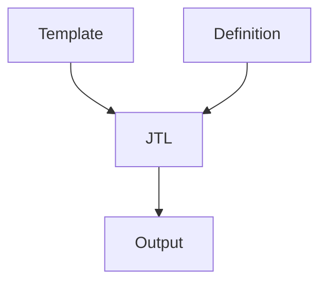

# JTL
## Java Template Language Extension
Java Template Language (JTL) is a *template processor*, which can generate arbitrary textual output based on a data and a template. The reason for such tool is to separate varying and fixed patterns about text and code generation into a definition (data) and a template. 
Usually JTL uses template files (stored with extension jtl) and data definition files (stored as def or json or csv files) to generate arbitrary textual document. Additional features make it well suitable for code generation as well. For example modifications of generated files can be preserved in explicit sections.



## Table of Contents
- [Installation](#installation)
- [Usage](#usage)
- [Examples](#examples)
- [Definitions](#definitions)
- [Templates](#templates)
- [License](#license)

## Installation
1. Clone the repository
2. Install Java JDK. This is needed to compile templates. For execution of compiled templates JRE is sufficient.
3. Check if you can build JTL.jar. For this go into `build` directory. Run `build.bat` or `build.sh` depending on your system.
4. Run `jtl.bat` or `jtl.sh` and check if you can see version information.

## Usage
1. Write a template file (see examples/example1/example1.jtl)
2. Write a definition file (see examples/example1/example1.def)
3. Write a project file (see examples/project_1.jtlp)
4. Execute `jtl.sh` or `jtl.bat` and provide project file as parameter

## Examples
Examples are provided in folder examples
1. Simple printing of text
2. Creating a simple c++ file
3. Dumping definition stored in json and csv files
4. Manual sections, own imports and empty definition

## Definitions
Can be in native `def` format or in `json` or in `csv`. For `json` and `csv` there is transformation into `def` format internally.
In example3 the json and csv files are dumped for clarity.

### JSON files 
The JSON arrays are represented as entities with one parameter with name “_array_”. All children entities of array have name “_elem_”.
Example:
```json
{
    "firstName": "John",
    "lastName": "Smith",
    "age": 25,
    "address": {
        "streetAddress": "21 2nd Street",
        "city": "New York",
        "state": "NY",
        "postalCode": 10021
    },
	"phoneNumbers": [
        {
            "type": "home",
            "number": "212 555-1234"
        },
        {
            "type": "fax",
            "number": "646 555-4567" 
        }
    ],
	"key1":"val1"
}
```

And internal representation:

```def
json()
{
  firstName("John")
  lastName("Smith")
  age("25")
  address()
  {
    streetAddress("21 2nd Street")
    city("New York")
    state("NY")
    postalCode("10021")
  }
  phoneNumbers("_array_")
  {
    _elem_()
    {
      type("home")
      number("212 555-1234")
    }
    _elem_()
    {
      type("fax")
      number("646 555-4567")
    }
  }
  key1("val1")
}
```

### CSV files
The root entity name is “csv”.
Every line is one entity with name “_elem_”. The values are stored as parameters of entity.
The CSV Format corresponds to format generated by Excel.

Example of CSV file:
```csv
reg1;654;56;0x6564;6654
reg2;655;57;0x6564;6655
reg3;656;58;0x6564;6656
reg4;657;59;0x6564;6657
reg5;658;60;0x6564;6658
reg6;659;61;0x6564;6659
```

```def
csv()
{
  _elem_("reg1","654","56","0x6564","6654")
  _elem_("reg2","655","57","0x6564","6655")
  _elem_("reg3","656","58","0x6564","6656")
  _elem_("reg4","657","59","0x6564","6657")
  _elem_("reg5","658","60","0x6564","6658")
  _elem_("reg6","659","61","0x6564","6659")
}
```

## Templates
Templates files have extension ".jtl". This file contains a mixture of text and controlling code. The text part is taken as-is to the output. The controlling code implements various generation logic like loops, if-statements etc.
JTL was designed to be a so called “natural template language”. Which means that if jtl file contains no controlling code at all the output is exactly the same as content of jtl file.
For better understanding there are files stored in examples folder for all the tutorials and examples reference in this document. 

`example1.jtl`:
```java
Example 1: Hello JTL World!!!
@for (JTLEntity e:entity.children) {
Hello @[e.param(0)]@
@}
```

`example1.def`:
```def
examples
{
	who("World")
	who("JTL Users")
}
```

`output:`
```text
Example 1: Hello JTL World!!!
Hello World
Hello JTL Users
```
### Control code and Expressions
There are three escape sequences used for controlling template processing. All of them use "@" character.
If your JTL code starts, you will have the parameter `entity` of type `JTLEntity` already available and pointing to parsed content of definition.
The control code types are described in following chapters. Control code is regular Java code which is injected into template processing.
#### Single line control code
The “@” character in jtl file is used for escaping into control code section. 
Put this character at the beginning of a line and this line will be control code. 
Control code can be arbitrary Java code which you are allowed to use inside a method.
In the example1 above it is used to define the `for` loop.
#### Inline replacement
The second escape sequence is used for replacing parts by using string expressions from control code. 
This escape sequence is "@\[" for opening and "]@" for closing.
In the example1 above it is used to replace @[e.param(0)]@ with the first param of child in the `def` file.

#### Multiline control code
The third sequence is used for larger control code blocks. It’s started by "@<" and closed with "@>". Everything in between of this sequences is interpreted as Java code. 
This can be used instead of prepending every line with "@"
You can see this in `examples/example2.jtl`.

### File creation
In most cases we want to write our output to a certain file. For example if we generate C++ code we would write cpp and h files. Even if piping out console output to a file is an option we should definitely avoid this and use methods provided by JTL.
This is done by methods "*file()*" and "*close()*" inside a control block. 
See `examples/example2.jtl` for details.

### Manual sections
A very useful and powerful method for code generation framework is possibility to update portions of the file which is kept during the generation rounds. 
For example implementing generated stubs for method calls or similar. For this reason two methods are available: "*manual_begin()*" and "*manual_end()*". 
Everything between them is preserved during subsequent generation runs.
See `examples/example4.jtl` for details.

### JTL header file
In order to include own import or external imports You need to create additional file with file extension `jtl_header`.
This file will be copied into intermediate java file during template processing. Put your import declarations in this file.
See `examples/example4.jtl` for details. The additional header file is called `example4.jtl_header`

### Extended usage
Your templates will be derived from `JTLTemplate`, so all methods of `JTLTemplate` are directly usable in control code.
The definitions are parsed into `JTLEntity` instance, so everything related to access definition data is implemented in `JTLEntity`. 
For more information see files [JTLEntity.java](https://github.com/alexk195/jtl/blob/main/src/JTLEntity.java) and [JTLTemplate.java](https://github.com/alexk195/jtl/blob/main/src/JTLTemplate.java)).

### Public methods of JTLTemplate
Here are all the public methods of JTLTemplate.java in a table:

| Method Signature | Description |
|------------------|-------------|
| `public void println(CharSequence c) throws IOException` | Prints a line to output. |
| `public void println(Vector<String> vs) throws IOException` | Prints a vector of strings to output. |
| `public void manual_begin(JTLEntity e) throws Exception` | Starts a manual code section with the given entity. |
| `public void manual_begin(String id) throws Exception` | Starts a manual code section with the given id. |
| `public void manual_start(JTLEntity e) throws Exception` | Deprecated. Starts a manual code section with the given entity. |
| `public void manual_start(String id) throws Exception` | Deprecated. Starts a manual code section with the given id. |
| `public void manual_end() throws Exception` | Ends a manual code section. |
| `public void manual_patterns(String pbegin, String pend)` | Sets manual section patterns. |
| `public void manual_patterns_default()` | Sets manual section patterns to default. |
| `public void file(String filename) throws Exception` | Starts writing to a new file with the given filename. |
| `public void folder(String foldername) throws Exception` | Creates a folder if not existent. |
| `public Vector<String> load_file(String fname) throws Exception` | Reads a file and returns its contents as a vector of strings. |
| `public String template()` | Returns the template file name. |
| `public String definition()` | Returns the definition file name. |
| `public void manual_prefix(String s)` | Sets the prefix string for manual code sections. |
| `public String manual_prefix()` | Returns the prefix string for manual code sections. |
| `public void manual_postfix(String s)` | Sets the postfix string for manual code sections. |
| `public String manual_postfix()` | Returns the postfix string for manual code sections. |
| `public String version()` | Returns the version as a string. |
| `public final JTLContext ctx()` | Returns the context. |
| `public final void ctx(JTLContext _ctx)` | Sets the context. |
| `public void warning(String what)` | Prints an error message from inside the template. |
| `public void disable_backup()` | Disables backup file creation for the currently opened file. |
| `public void enable_backup()` | Enables backup file creation for the currently opened file. |
| `public static void _run(String args[], JTLTemplate t, String templateName)` | Entry method for template generation, overridden in all templates. |

### Public methods of JTLEntity
Here are all the public methods of JTLEntity in a table:

| Method Signature | Description |
|------------------|-------------|
| `public JTLEntity()` | Constructor to initialize a JTLEntity object. |
| `public JTLEntity child(String sname)` | Returns child by given name. |
| `public boolean hasChild(String sname)` | Returns true if child exists. |
| `public String fullpath()` | Returns full path of entity with "/" as delimiter. |
| `public JTLEntity child(int nr) throws Exception` | Returns child by index. |
| `public String param(int nr) throws Exception` | Returns param by index. |
| `public boolean isLast()` | Returns true if this child is last one. |
| `public boolean isFirst()` | Returns true if this child is first one. |
| `public Character ifLast(Character *then, Character *else)` | Returns *then character if entity is last child, *else otherwise. |
| `public String ifLast(String *then, String *else)` | Returns *then String if entity is last child, *else otherwise. |
| `public Character ifFirst(Character *then, Character *else)` | Returns *then character if entity is first child, *else otherwise. |
| `public String ifFirst(String *then, String *else)` | Returns *then String if entity is first child, *else otherwise. |
| `public String toString()` | Returns the name of the entity. |
| `public JTLEntity addChild(JTLEntity e)` | Adds child to entity. |
| `public JTLEntity addParam(String p)` | Adds parameter to entity. |
| `public JTLEntity setParam(int i, String p) throws Exception` | Sets parameter by index. |
| `public void dump(int depth)` | Dumps the entity recursively for debugging with provided depth (=indentation). |
| `public void dump()` | Dumps the definition in def format. |
| `public void dumpXML(int depth)` | Dumps the entity in XML format with provided depth (=indentation). |
| `public void dumpXML()` | Dumps the definition in XML format. |


## License
MIT License, see LICENSE file 
